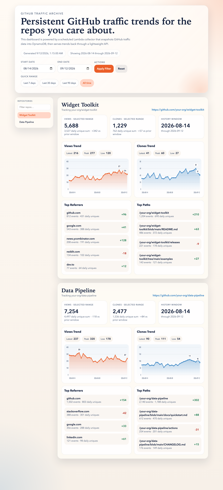

# GitHub Traffic Analyzer

This project archives GitHub traffic data for a configurable set of GitHub repositories inside your AWS account so you can keep long-term trends beyond GitHub's built-in 14-day retention window. The repositories to track are supplied through the `TrackedRepositories` deploy parameter (persisted in `samconfig.toml`), so a single deployment can archive one or many repositories. The shipped default is a placeholder (`your-org/your-repo`) that you must replace with your own repositories before deploying — see [Deploy](#deploy) and [Add Another Repository](#add-another-repository). The GitHub traffic API requires push access, so there is no default repository that works for everyone out of the box.

It is built with serverless-first principles:

- AWS Lambda collects GitHub traffic on a schedule.
- DynamoDB stores the historical archive.
- API Gateway + Lambda serve a lightweight dashboard and JSON API.
- Secrets Manager keeps the GitHub token out of code and environment files.

## Table of Contents

- [Dashboard](#dashboard)
- [Architecture](#architecture)
- [What Gets Archived](#what-gets-archived)
- [Prerequisites](#prerequisites)
- [Get The Code](#get-the-code)
- [Create The GitHub Token](#create-the-github-token)
- [Create The GitHub Secret](#create-the-github-secret)
- [Deploy](#deploy)
- [Add Another Repository](#add-another-repository)
- [Trigger A Manual Collection](#trigger-a-manual-collection)
- [API Endpoints](#api-endpoints)
- [Teardown](#teardown)
- [Contributing](#contributing)
- [License](#license)

## Dashboard

Once deployed, the dashboard renders per-repository view/clone trends, summary
cards, and top referrers/paths over the archived history:



> The screenshot above uses placeholder repositories and sample data for
> illustration.

## Architecture

```text
EventBridge Schedule
        |
        v
Collector Lambda -----> GitHub Traffic API
        |
        v
   DynamoDB Archive <----- Dashboard/API Lambda
                               |
                               v
                         API Gateway HTTP API
```

## What Gets Archived

- Daily `views`
- Daily `clones`
- Rolling 14-day `top referrers` snapshots
- Rolling 14-day `top paths` snapshots

GitHub only exposes the last 14 days of traffic. The collector runs daily and persists each day's data so the archive keeps growing. For daily `uniques`, the dashboard presents them as a sum of daily unique counts, not a de-duplicated multi-day audience total.

## Prerequisites

- AWS SAM CLI
- Python 3.12 (matches the Lambda runtime; 3.11+ works for local validation)
- An AWS account with permissions to deploy Lambda, DynamoDB, API Gateway, EventBridge, CloudWatch Logs, and Secrets Manager
- A GitHub token that can read repository traffic (see below)

## Get The Code

```bash
git clone <this-repository-url>
cd github-traffic-analyzer
```

## Create The GitHub Token

The GitHub traffic API requires **push (write) access** to a repository —
read-only access returns `403` even for public repositories. Create a
[personal access token](https://github.com/settings/tokens) owned by a user who
has push access to every repository you want to track:

- **Classic token:** enable the `repo` scope.
- **Fine-grained token:** grant **Administration: Read-only** on the selected
  repositories (and select every repository you list in `TrackedRepositories`).

Keep the token value handy for the next step; you will not need it again after
storing it in Secrets Manager.

## Create The GitHub Secret

Store the token in Secrets Manager. You can use a plain string secret or JSON
like `{"token":"ghp_xxx"}`. The secret name must match the
`GitHubTokenSecretName` deploy parameter (default `github-traffic-token`).

```bash
aws secretsmanager create-secret \
  --name github-traffic-token \
  --secret-string '{"token":"YOUR_GITHUB_TOKEN"}'
```

## Deploy

Build and deploy with SAM:

```bash
sam build
sam deploy --guided
```

Suggested parameter values during the guided deploy:

- `GitHubTokenSecretName`: `github-traffic-token`
- `TrackedRepositories`: `[{"owner":"your-org","name":"your-repo","label":"Your Repository"}]` (replace with your own repositories)
- `DashboardCorsOrigin`: `*`

After deployment, the stack output `DashboardUrl` points to the live dashboard.

The collector runs on a daily schedule (~05:15 UTC), so the first data appears
the next day — or immediately if you [trigger a manual collection](#trigger-a-manual-collection).

> **Security note:** with the defaults above, the dashboard and `/api/traffic`
> JSON endpoint are **publicly accessible** to anyone who has the `DashboardUrl`
> (`DashboardCorsOrigin` is `*` and the HTTP API has no authorizer). This is fine
> for public repository traffic, but if you track private repositories or want to
> restrict access, put the API behind an authorizer, restrict the CORS origin, or
> front it with something that enforces authentication.

## Add Another Repository

The list of tracked repositories is the source of truth in `samconfig.toml`, under the `parameter_overrides` line for the `TrackedRepositories` parameter. Editing it there ensures every `sam deploy` applies the full list — a plain `sam deploy` that omitted the override would otherwise reset the tracked repositories to the template default.

1. Make sure the GitHub token stored in Secrets Manager can access repository traffic for the new repository.
2. If the token is fine-grained, add the new repository to the token's allowed repository list.
3. Expand the `TrackedRepositories` JSON array in `samconfig.toml` to include the new repository.
4. Redeploy with `sam build && sam deploy` (the persisted parameter override is applied automatically).
5. Optionally invoke the collector once so the new repository appears immediately instead of waiting for the next scheduled run (see [Trigger A Manual Collection](#trigger-a-manual-collection)).

Each tracked repository entry supports this shape:

```json
{
  "owner": "OWNER",
  "name": "REPOSITORY",
  "label": "Optional Display Name"
}
```

In `samconfig.toml` the array is stored as a single escaped string. For example, tracking two repositories looks like this:

```toml
parameter_overrides = "TrackedRepositories='[{\"owner\":\"your-org\",\"name\":\"your-repo\",\"label\":\"Your Repository\"},{\"owner\":\"OWNER\",\"name\":\"REPOSITORY\",\"label\":\"Optional Display Name\"}]'"
```

Then redeploy:

```bash
sam build
sam deploy --profile YOUR_AWS_PROFILE
```

If you already use the default AWS credential chain, omit the `--profile` flag.

After redeploy:

- The dashboard will render a separate section for the new repository.
- The collector will ingest the new repository on the next scheduled run.
- Existing archived data for already tracked repositories remains in DynamoDB.

## Trigger A Manual Collection

The schedule runs once per day, but you can also invoke the collector manually right after deployment:

```bash
aws lambda invoke \
  --function-name "$(aws cloudformation describe-stacks \
    --stack-name github-traffic-analyzer \
    --query 'Stacks[0].Outputs[?OutputKey==`CollectorFunctionName`].OutputValue' \
    --output text)" \
  /tmp/github-traffic-collector-response.json
cat /tmp/github-traffic-collector-response.json
```

## API Endpoints

- `GET /` dashboard UI
- `GET /api/traffic` JSON payload for charts and summaries
  - Optional query params: `startDate=YYYY-MM-DD` and `endDate=YYYY-MM-DD`
- `GET /health` basic health response

## Teardown

Remove the stack and all its resources when you are done:

```bash
sam delete --stack-name github-traffic-analyzer
```

This deletes the DynamoDB table and its archived data. The GitHub token secret
is created separately (see [Create The GitHub Secret](#create-the-github-secret)),
so delete it on its own if you no longer need it:

```bash
aws secretsmanager delete-secret --secret-id github-traffic-token
```

## Contributing

Contributions are welcome via fork and pull request. Code is linted and
formatted with [ruff](https://docs.astral.sh/ruff/), enforced by a `pre-push`
git hook and a deploy wrapper. See [CONTRIBUTING.md](CONTRIBUTING.md) for the
full workflow, the quality gate, and project guidelines.

## License

Licensed under the MIT No Attribution license (MIT-0). See [LICENSE](LICENSE).
